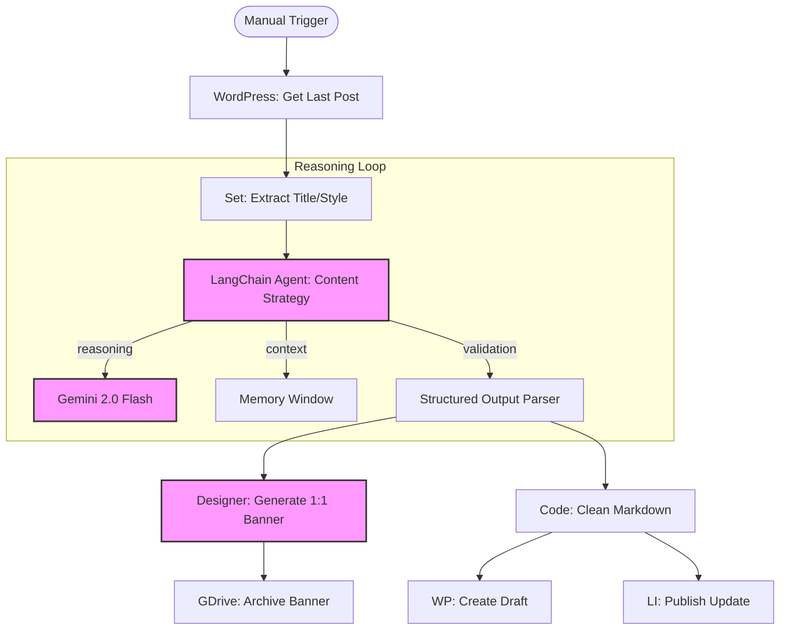

# ✍️ Agent - Content Writer

A professional, high-reasoning n8n agent designed for autonomous SEO content generation and cross-platform publishing. Powered by **Google Gemini 2.0**, this agent automates the entire lifecycle of a blog post, from topic ideation to image generation and social distribution.

---

## � Features

- **Inteligent Topic Ideation**: Automatically analyzes your last WordPress post to generate fresh, contextually relevant follow-up topics.
- **Advanced SEO Writing**: Generates high-quality blog posts (up to 2500 chars) that answer critical user intent questions (What/How/Advantages/Usage).
- **AI Image Generation**: Uses **Gemini 2.0 Flash Preview** to create professional 1:1 square banners relevant to the post content.
- **Autonomous Memory Management**: Implements a "Memory Buffer Window" to prevent repetitive content if the same topic is suggested multiple times.
- **Multi-Channel Distribution**:
  - **WordPress**: Creates refined draft posts with sanitized markdown.
  - **LinkedIn**: Publishes professional updates with attribution.
  - **Google Drive**: Archives all generated banners for future use.

---

## �️ Technical Stack

- **Orchestration**: [n8n](https://n8n.io/)
- **LLM Reasoning**: Google Gemini 2.0 Flash
- **Image Intelligence**: Gemini 2.0 Flash Preview (Image Generation)
- **Framework**: LangChain (via n8n nodes)
- **Data Persistence**: n8n Memory Buffer

---

## 📊 Workflow Architecture



---

## 📋 Credential Manifest

To deploy this agent, you must configure the following credentials in your n8n instance:

| Provider          | Credential Type        | Purpose                             |
| :---------------- | :--------------------- | :---------------------------------- |
| **Google Gemini** | `googlePalmApi`        | Content writing & image generation. |
| **WordPress**     | `wordpressApi`         | Fetching context & creating drafts. |
| **LinkedIn**      | `linkedInOAuth2Api`    | Publishing automated updates.       |
| **Google Drive**  | `googleDriveOAuth2Api` | Storing generated banners.          |

---

## � Interoperability & Integration

This agent is built to be a node in a larger "Agentic Mesh". You can trigger this agent from other workflows by passing a JSON payload:

### Expected Input (via HTTP/Webhook)
```json
{
  "content": "Specific topic to write about (Optional - AI will decide if omitted)"
}
```

### Structured Output
The agent returns a verified JSON object:
```json
{
  "title": "SEO Optimized Title",
  "content": "Full blog body text",
  "img_prompt": "Prompt used for designer",
  "img_title": "sanitized-file-name"
}
```

---

## 📋 Metadata

- **Author:** [Ilkay Beydah Saglam](https://github.com/beydah)
- **Created Date:** 2025-10-20
- **Last Updated:** 2026-02-20
- **Category:** Content Automation / AI Agents

---
[🔙 Back to Main README](https://github.com/beydah/N8N-AI-Agent)
