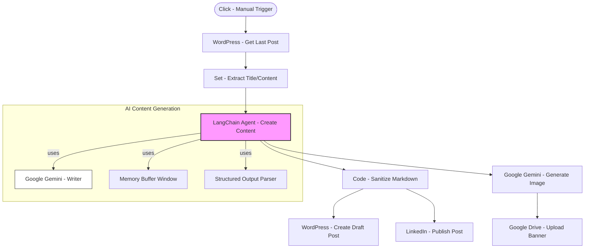

# Agent - Content Writer ✍️

Automated SEO-friendly blog post and image generation agent powered by Google Gemini AI.

## 📄 Overview

This agent is designed to generate high-quality blog content and accompanying visual prompts. It follows a structured workflow to retrieve previous content (for context), generate new topics, create images, and publish across multiple platforms.

## 🚀 Get Started

[⬇️ Download agent.json](./agent.json)

> [!TIP]
> To use this agent, import the `.json` file into your n8n instance and configure the required credentials (Gemini, LinkedIn, WordPress, Google Drive).

## 📊 Workflow Diagram

## 🛠️ Interoperability

This agent is built to be "Agent-Friendly". You can trigger it from another agent using:
- **HTTP Node**: Call the n8n Webhook URL (if configured).
- **Execute Workflow Node**: Call this workflow by its ID.

## 📋 Metadata

- **Author:** [Ilkay Beydah Saglam](https://github.com/beydah)
- **Created Date:** 2025-10-20
- **Last Updated:** 2026-02-20
- **Category:** Content Automation / AI Agents

---
[🔙 Back to Main README](../../README.md)
